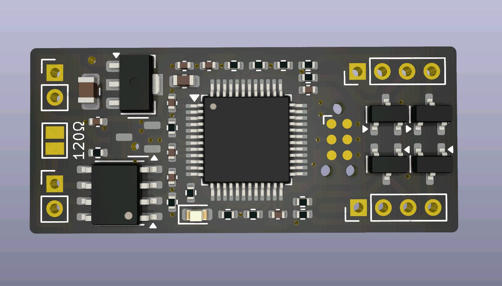

# canbus sensor board

A simple board optimized for handling I²C-connected sensors and communicate the status over CAN bus.



This repo contains both the PCB design files, as well as Rust-based firmware.

To flash and run the firmware:

  * Install Rust.  Using [rustup](https://rustup.rs/) is very strongly encouraged as it automates
    installation of cross compilation files and such.
  * Install `probe-rs`, a CLI for connecting to debug probes, with `cargo install probe-rs`.
  * Install `flip-link`, a meta-linker that puts the stack at the end of embedded memory, using
    `cargo install flip-link`.

Flash using a debug probe (easiest):

  * Connect the PCB to your computer using a SWD-based debug probe, for example a ST-Link v2 clone
    can be found super cheaply online, usually around $3 USD.  You can either solder wires to the
    provided pads (see PCB design files for pin assignments) or else use a TagConnect TC2030-NL
    cable, which has pogo pins matching the pads on the board, and can be bought with adapter wires
    that are compatible with an ST-Link module.
  * Run `cargo flash --release` to flash to the board **or** run `cargo run` to flash the firmware
    using a debug build, start it, and stream debug logs to the terminal using the defmt RTT
    protocol. (You can of course also do any combination, e.g. `cargo run --release` etc)

Flash using CAN bus (more tricky perhaps):

  * Install [`can-prog`](https://github.com/marcinbor85/can-Prog), see the link for additional
    details.
  * Connect the PCB to a CAN bus.
  * Using some wires, first short the 3.3V and BOOT pads, and while still shorting the pads, also
    short the ~RST and GND pads.  This should put the board in DFU mode.
  * Build the firmware in release mode with `cargo build --release`
  * Convert the generated ELF file to a raw `.bin` file with:
    ```
    arm-none-eabi-objcopy -O binary target/thumbv7m-none-eabi/release/canbus-sensor-board image.bin
    ```

  * Run the command `canprog -f bin stm32 write image.bin -a 0x08000000` or similar. You might need
    to run `canprog stm32 erase` and such depending on the state of the firmware.
